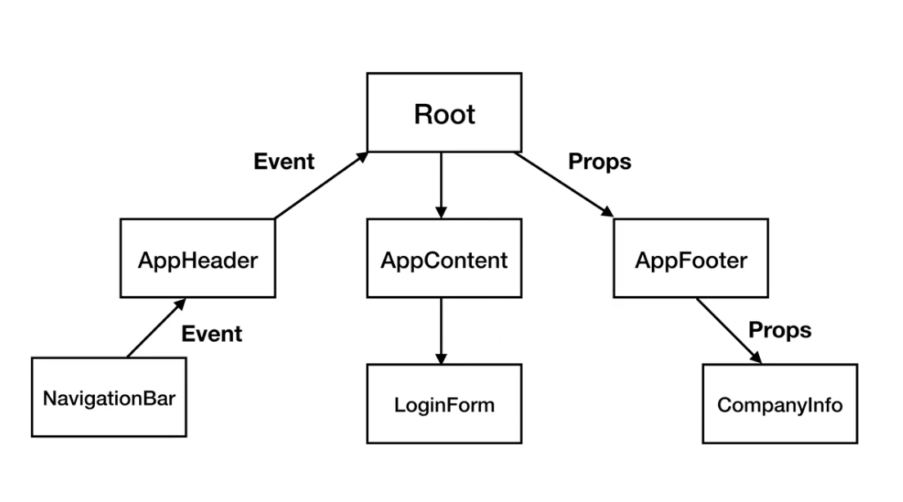

# 컴포넌트 통신 방식

- 상위에서 하위로는 데이터를 내려줌, 프롭스 속성
- 하위에서 상위로는 이벤트를 올려줌, 이벤트 발생  

>특정 컴포넌트의 변화에 따라서 나머지 컴포넌트가 유기적으로 계속 데이터를 주고 받았을 때 데이터의 방향을 예측하기 어렵다.  
특정 상태, 어떤 데이터가 바뀌었을 때 그로 인한 버그를 추적하기가 어려움 
$\rightarrow$ n방향 통신의 문제점(과거 MVC 패턴)

- Vue의 컴포넌트 통신 규칙: 데이터가 아래 방향으로만 내려감. 따라서 데이터의 흐름을 추적할 수 있음.
